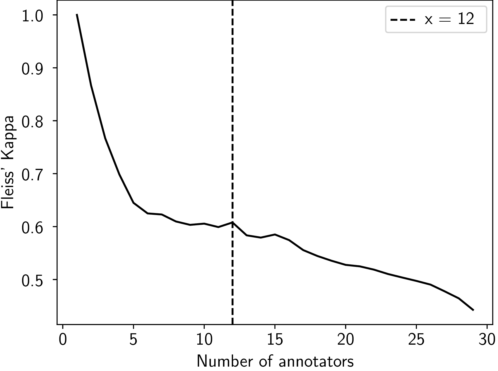
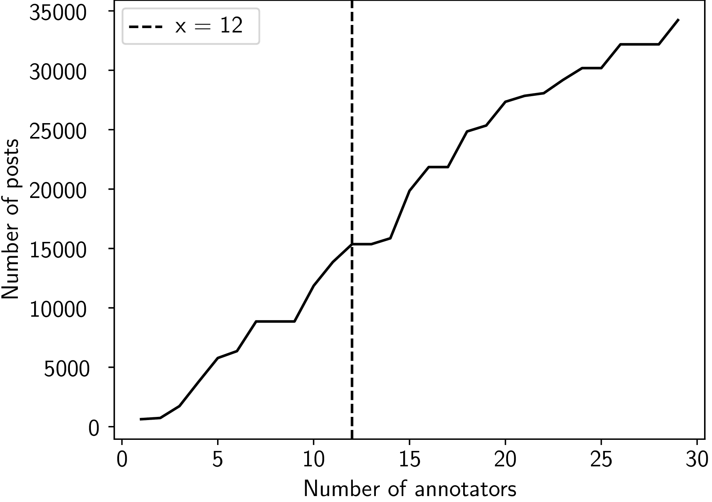

# Corpus of Hate speech in Online Comments from German Newspapers (HOCON34k)
## A German Corpus on hatespeech posts from newspapers
On this page we provide the data set for the corpus of Hate speech in Online Comments from German Newspapers (HOCON34k), which was first presented on the [26th International Conference on Information Integration and Web Intelligence](https://www.iiwas.org/conferences/iiwas2024/) (iiWAS 2024) along with a dataset paper.
<!-- Details can be found in the section [Citation](#citation) below. -->

## Description
We present a dataset of 34,223 comments in German, authored by users of online platforms associated with public discourse in German newspapers. Each comment was annotated for hate speech and the adequacy of contextual information by 29 volunteers using a binary annotation scheme. The inter-rater reliability for hate speech, measured by Fleiss’ Kappa, is 0.4428 across all annotators, improving to 0.6078 when focusing on an optimized subset of 12 annotators. Additionally, we provide a baseline text classification using BERT, which achieved an MCC-score of up to 0.32 and an F2-score of up to 0.64 in initial experiments with this corpus.

### Classes to annotate
During annotation, volunteers rated two aspects of a post: the presence of hate speech and the presence of enough context for a fairly confident rating of hate speech. This allowed the volunteers to assign one of the following four labels to each comment: *Hate speech (enough context)*, *Not Hate speech (enough context)*, *Hate speech (not enough context)*, *Not Hate speech (not enough context)*.

### Data Description

<table>
<colgroup>
<col style="width: 18%" />
<col style="width: 36%" />
<col style="width: 44%" />
</colgroup>
<thead>
<tr class="header">
<th style="text-align: left;">Column</th>
<th style="text-align: left;">Name</th>
<th>Description</th>
</tr>
</thead>
<tbody>
<tr class="odd">
<td style="text-align: left;">newspaper_id</td>
<td style="text-align: left;">Newspaper ID</td>
<td>Pseudonym Identity of the newspaper as consecutive numbers</td>
</tr>
<tr class="even">
<td style="text-align: left;">post_id</td>
<td style="text-align: left;">Post ID</td>
<td>Source ID from the newspaper</td>
</tr>
<tr class="odd">
<td style="text-align: left;">annotator_id</td>
<td style="text-align: left;">Annotator ID</td>
<td>Pseudonym Identity of the annotators as consecutive numbers</td>
</tr>
<tr class="even">
<td style="text-align: left;">phase</td>
<td style="text-align: left;">Phase</td>
<td>2 or 3</td>
</tr>
<tr class="odd">
<td style="text-align: left;">split_all</td>
<td style="text-align: left;">Split for all annotators</td>
<td>“train”, “test”, or “val”</td>
</tr>
<tr class="even">
<td style="text-align: left;">split_12</td>
<td style="text-align: left;">Split for 12 annotators</td>
<td>“train”, “test”, or “val”</td>
</tr>
<tr class="odd">
<td style="text-align: left;">label</td>
<td style="text-align: left;">Hatespeech and context annotation</td>
<td>"Hatespeech (enough context)",<br/>
"Hatespeech (not enough context)",<br/>
"Not Hatespeech (enough context)" or<br/>
"Not Hatespeech (not enough context)"</td>
</tr>
<tr class="even">
<td style="text-align: left;">label_hs</td>
<td style="text-align: left;">Hatespeech annotation</td>
<td>Binary (1 or 0)</td>
</tr>
<tr class="even">
<td style="text-align: left;">label_context</td>
<td style="text-align: left;">Context annotation</td>
<td>Binary (1 or 0)</td>
</tr>
<tr class="odd">
<td style="text-align: left;">text</td>
<td style="text-align: left;">Text</td>
<td>Text of the comment</td>
</tr>
</tbody>
</table>

## Statistics
In order to achieve a high quality of annotation, a preliminary training phase was carried out, whereby the volunteers evaluated 52 comments. The results were then analyzed to assess the uniformity of the annotations, with [Fleiss' Kappa](https://en.wikipedia.org/wiki/Fleiss%27_kappa) used to measure inter-rater reliability. The agreement for all volunteers was 0.4428 for *hate speech*, representing a moderate agreement, and 0.0917 for the *context*, which indicated slight agreement.

After completion of the training phases, a further 34,223 comments were annotated, which form the core of the corpus. Their quality can be considered assured due to the solid inter-rater reliability of the training phases. Table 1 shows the distribution of comments across the different classes. The majority of comments, 84.7 %, were labeled as not hate speech. The criterion for determining whether there was enough context for the evaluation of hate speech depended significantly on the hate speech rating itself. For non-hate speech comments, sufficient context was identified in 83.0% of cases, whereas for hate speech comments, sufficient context was identified only 63.1% of the time. This suggests that the presence of sufficient context is more often considered critical when classifying hate speech, whereas it is less frequently a concern for non-hate speech comments, where it is almost always assumed to be sufficient.

<figure>
<figcaption>Tab.1 - Number of comments per class in 34,223 comments</figcaption>
<table style="margin: 0px auto;">
  <thead>
    <tr>
      <th></th>
      <th align="right">Comments</th>
      <th align="right">Percent</th>
    </tr>
  </thead>
  <tbody>
    <tr>
      <td align="left">Not hate speech</td>
      <td align="right">28,992</td>
      <td align="right">84.7 %</td>
    </tr>
    <tr>
      <td align="left">- Not enough context</td>
      <td align="right">4,922</td>
      <td align="right">17.0 %</td>
    </tr>
    <tr>
      <td align="left">- Enough context</td>
      <td align="right">24,070</td>
      <td align="right">83.0 %</td>
    </tr>
    <tr>
      <td align="left">Hate speech</td>
      <td align="right">5,231</td>
      <td align="right">15.3 %</td>
    </tr>
    <tr>
      <td align="left">- Not enough context</td>
      <td align="right">1,932</td>
      <td align="right">36.9 %</td>
    </tr>
    <tr>
      <td align="left">- Enough context</td>
      <td align="right">3,299</td>
      <td align="right">63.1 %</td>
    </tr>
    <tr>
      <td align="left">Not enough context</td>
      <td align="right">6,854</td>
      <td align="right">20.0 %</td>
    </tr>
    <tr>
      <td align="left">Enough context</td>
      <td align="right">27,369</td>
      <td align="right">80.0 %</td>
    </tr>
  </tbody>
</table>
</figure>

## Inter-rater Reliability Optimization
The inter-rater reliability observed during the training phase underscores the difficulty of achieving a consistent understanding of hate speech across a large group of annotators. We found that the Fleiss’ Kappa score can be improved by reducing the size of the annotator group. The main challenge lies in identifying the annotators whose interpretations of hate speech are most aligned with the desired understanding. To address this, we compared the annotation behavior of all annotators with the assessments made by a lead expert. This expert, with extensive experience in the field and a rigorous evaluation process, served as the benchmark. In our case, the lead expert was a community manager from a large publishing group, who regularly screens and moderates a high volume of user comments. We used the results from the training phase to compare the annotators’ understanding of hate speech with the expert’s judgments. For each annotator, we calculated their pairwise inter-rater reliability with the expert. A threshold was then applied, where only the annotations from those achieving a Kappa ≥ 0.61 with the lead expert were retained. This threshold was met by twelve annotators. As a result, the overall Fleiss’ Kappa score for the group increased from 0.4428 (moderate agreement) to 0.6078 (substantial agreement) as shown in Figure 1 (left). While this method improved inter-rater reliability, it also reduced the amount of annotated data. However, previous tests indicated that models trained on this filtered dataset benefited from the increased agreement rate. The final dataset, comprising 15,358 comments (see Figure 1, right), strikes an effective balance between data quality and quantity for our application.


<div>
<figure>
<table style="margin: 0px auto;">
<tr>
<td></td>
<td></td>
</tr>
</table>
<figcaption align="center">Fig.1 - Annotator group size for inter-rater reliability optimization</figcaption>
</figure>
</div>

## License
The corpus is provided under the terms of the [Creative Commons Attribution 4.0 International (CC BY 4.0) License](https://creativecommons.org/licenses/by/4.0/). By using the corpus you agree to this license.


## Citation
The corpus was first presented at [iiWAS 2024](https://www.iiwas.org/conferences/iiwas2024/).
> *Max-Emanuel Keller, Maximilian Auch, Alexander Döschl, Fabian Vlk, Julian Quernheim, Mike Hartmann, Peter Mandl, Alexander Kaul, Markus Franz<br>
> **HOCON34k: Corpus of Hate speech in Online Comments from German Newspapers**<br>
> Proceedings of the 26th International Conference on Information Integration and Web Intelligence<br>
> Bratislava, Slovakia, December 2–4, 2024<br>*

If you are using the corpus, please cite the following publication. You can find a copy of the [paper here](https://www.iiwas.org/conferences/iiwas2024/iiwas-2024-proceedings.html). Reference in BibTeX format:
 ```
@inproceedings{Keller.2024,
 author = {Keller, Max-Emanuel and Auch, Maximilian and Döschl, Alexander and Vlk, Fabian and Quernheim, Julian and Hartmann, Mike and Mandl, Peter and Kaul, Alexander and Franz, Markus},
 title = {HOCON34k: Corpus of Hate speech in Online Comments from German Newspapers},
 booktitle = {26th International Conference on Information Integration and Web Intelligence},
 series = {iiWAS 2024},
 year = {2024},
 location = {Bratislava, Slovakia},
}
 ```


## How to use the data set?
The [repository to this page](https://github.com/ccwi/corpus-hocon34k) provides the data set to the corpus along with the statistics and instructions for use.

## About
The presented corpus was developed during a project of the <a href="https://www.wirtschaftsinformatik-muenchen.de/">Competence Center Wirtschaftsinformatik (CCWI)</a> at the Munich University of Applied Sciences.

<a href="https://www.wirtschaftsinformatik-muenchen.de/"></a>

## Acknowledgement
Our special thanks goes to the experts who contributed to the annotation of the corpus. The presented work was conducted as part of a project funded by *Forschungs- und Entwicklungsprogramm Informations- und Kommunikationstechnik des Freistaates Bayern*. Funding reference number: DIK-2104-0033// DIK0278/01, DIK0278/02,
DIK0278/03.

The methodology of this work was inspired by the great work of [Schabus et. al.](http://dx.doi.org/10.1145/3077136.3080711) wo created the [One Million Posts Corpus](https://ofai.github.io/million-post-corpus/) together with the Austrian newspaper *Der Standard* from user comments under online articles on the site of the newspaper.

<!--
## How to run the experiments?
-->
